# Pirate Island
Are you a budding pirate & want to go on a journey to hunt treasures? Well, what are you waiting for! Register yourself on the Pirate Island, buy your Gears, choose a Map & set to sail :)

**Youtube Demo**: [Pirate Island](https://youtu.be/VJsfbhJspGo)

## Inspiration
AhoyHacks Hackathon aims to bring together developers from around the globe to build something unique on the weekend. The theme of the hackathon & its motive is what inspired us to create **Pirate Island**. Pirate Island is a land of pirates, developers ( who wanna be Pirates ) visit the island, register themselves, buy some pirate gear, and then set sail to hunt for treasure.

## What it does
- Pirate Island opens up with an Introduction Screen, which gives budding pirates a gist of all the app's features
- Logged in Pirates are directed to Pirate Shop from where they can buy their pirate gears i.e everything they need before starting their journey as a Pirate. The shop offers various categories like Hats, Robes, Weapons, Ships, etc
- On selecting an item from the Shop, the user is navigated to ProductDetails. This screen offers a clean & minimalistic UI/UX to the user
- The user can Buy products, add them to his Favourites inventory, Check-out. The User can view the Order history from the Profile tab
- After selecting the gears, the Pirate can choose the Map he wants to explore & Hunt treasure

## How we built it
- The App ( Pirate Island ) is built using Flutter SDKs & Dart language. The Frontend was incorporated with Material-UI
- We used multiple Flutter packages to give the application a good look and feel

## Challenges we ran into
- Since the theme of the hackathon was Pirates we thought to stick to it completely. We wanted to build something interesting & focussed more on the UI/UX & Flutter internals
- Until now, we developed a few apps but this time we wanted to go beyond & build something on another level

## Accomplishments that we're proud of
- We are proud of developing an application from scratch within a weekend
- Creating a usable minimum viable product

## What we learned
- Gained insights into Flutter internals like Provider State management, Material Page Route, etc
- Learned to embed Auth0 into a Flutter application

## What's next for Pirate Island
- We invested most of our time building the UI & adding features to the app. Next, we will be adding user Login/SignUp using Auth0 authentication
- We will also be using Twilio to incorporate communication features into our application

## Tech Stack Used
- Flutter SDKs & Dart
- Material UI for Frontend
- Firebase as Realtime Database

## Screenshots
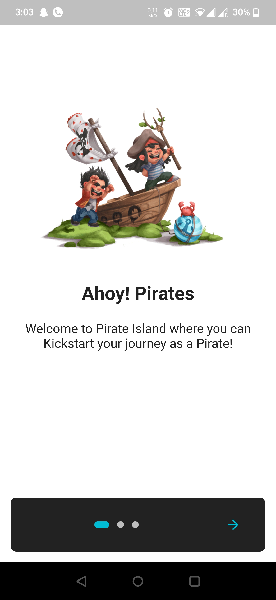 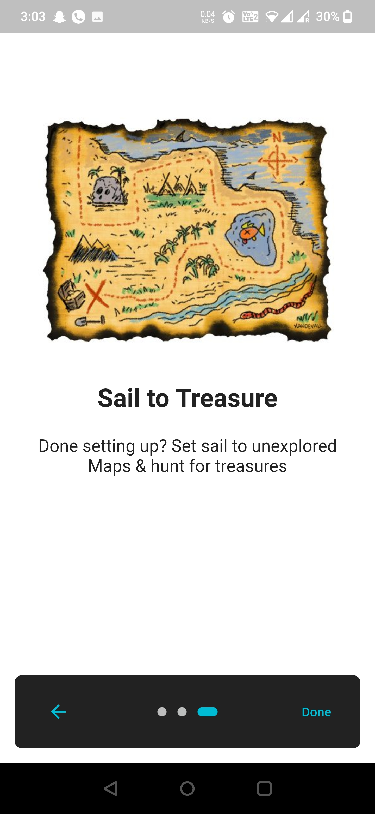 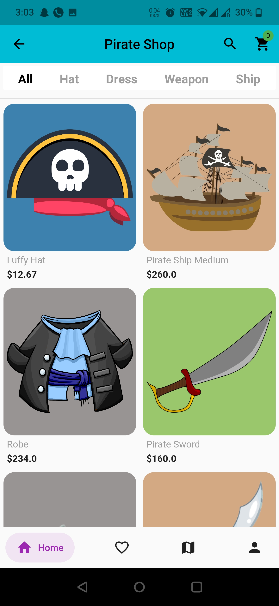 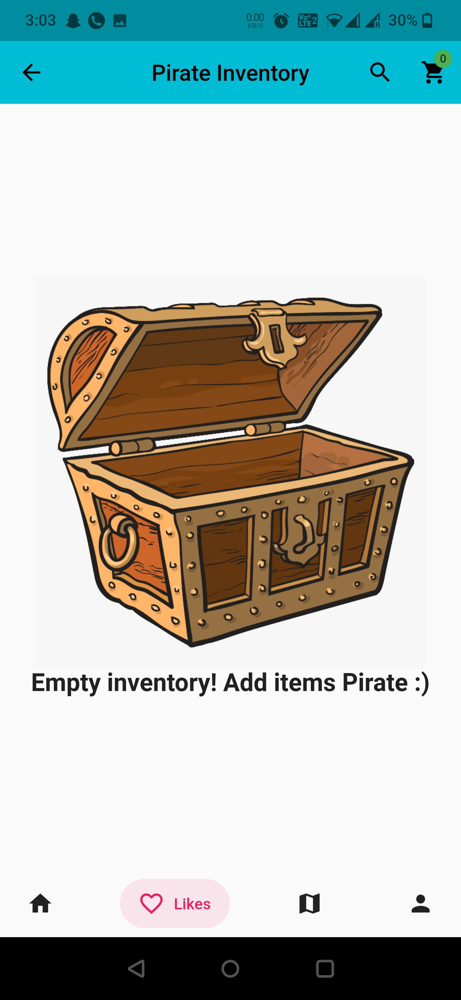  
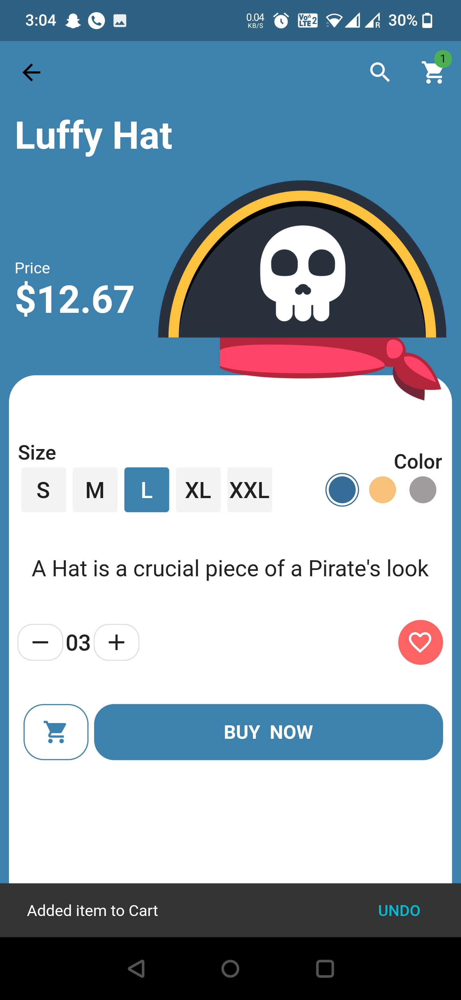 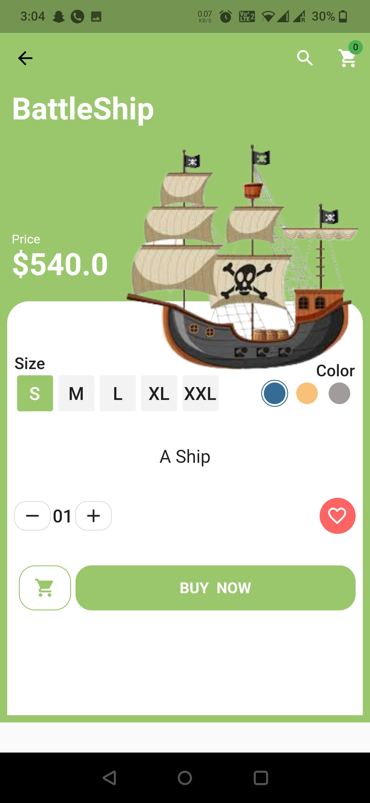 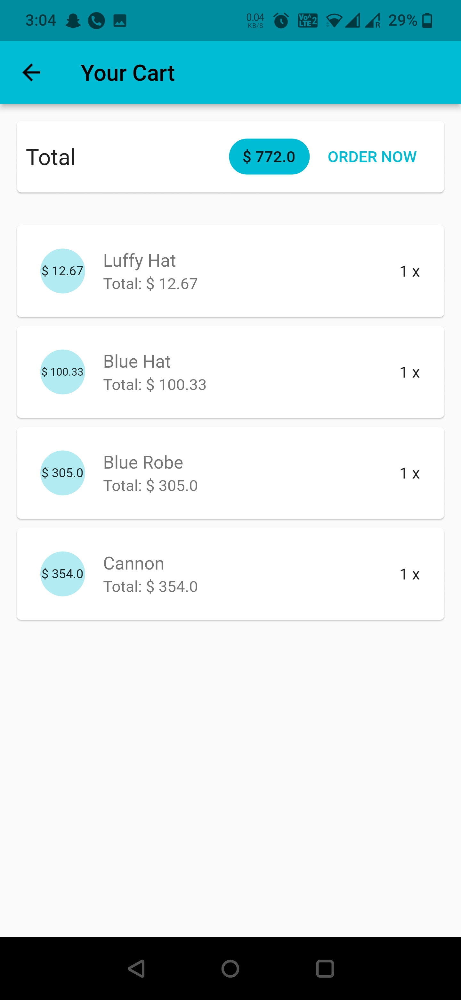 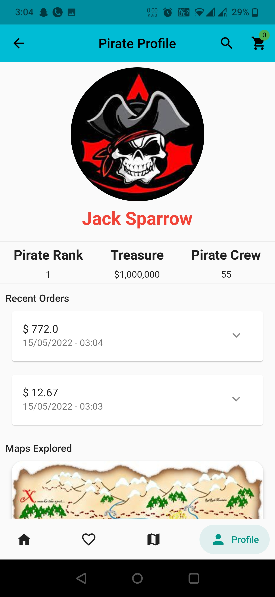   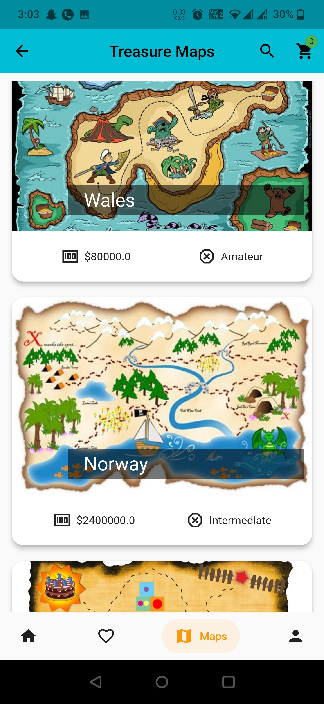 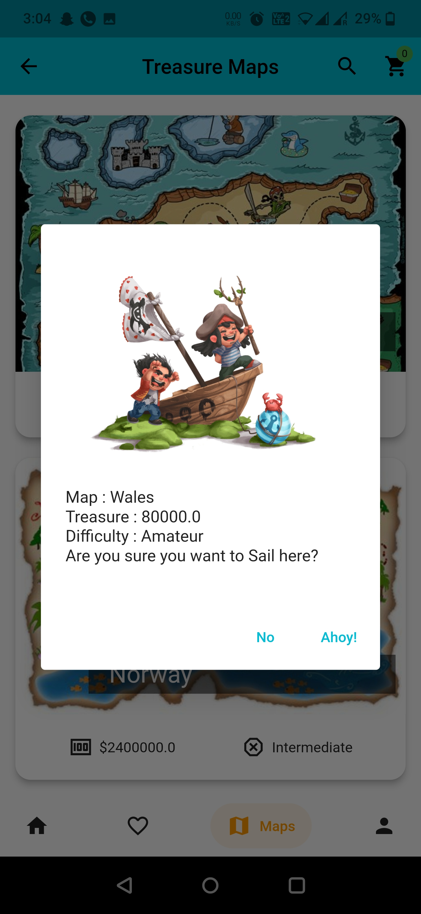 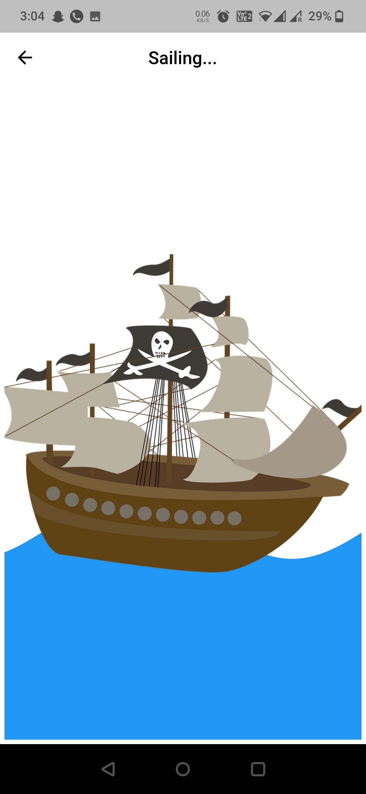
